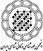
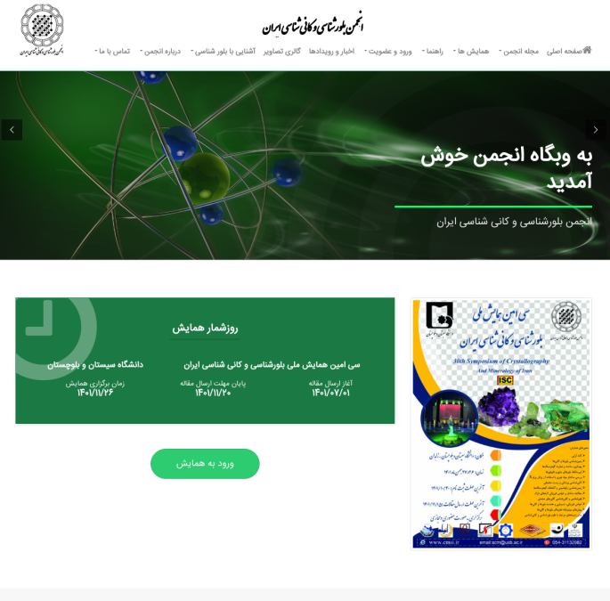

# Cmsi
<!-- Improved compatibility of back to top link: See: https://github.com/othneildrew/Best-README-Template/pull/73 -->

<!--
*** Thanks for checking out the Best-README-Template. If you have a suggestion
*** that would make this better, please fork the repo and create a pull request
*** or simply open an issue with the tag "enhancement".
*** Don't forget to give the project a star!
*** Thanks again! Now go create something AMAZING! :D
-->

<!-- PROJECT LOGO -->
 

  

<h3 align="center">Iranian Journal of Crystallography and Mineralogy</h3>

  

    <a href="http://cmsi.ir/" target="_blank">View Demo</a>
  

<!-- ABOUT THE PROJECT -->
## About The Project

CMSI.ir is a comprehensive system specifically designed for managing the Iranian Journal of Crystallography and Mineralogy conferences within Iran. This system serves as a platform where website administrators can efficiently input and organize all relevant information regarding the conferences organized by the association.

One of the primary functions of this system is to allow students to easily upload their articles directly onto the website. By utilizing this system, authors can conveniently submit their research papers and findings for consideration. Once submitted, the articles undergo a thorough review process facilitated by a panel of referees assigned to the conference. These referees carefully evaluate the submitted articles through their individual portfolios.

If an article does not receive initial approval from the referees, it is returned to the author with suggestions for revisions and corrections. However, articles that receive three positive votes from the referees are deemed eligible for publication in the forthcoming issue of the journal. This system effectively streamlines the review and publication process, ensuring that only high-quality, approved articles are published.

The CMSI.ir system encompasses all aspects of managing the website and its content, including the various sections, user management, and the oversight of referees and other individuals involved in the review process. These administrative tasks are handled by the main website administrator, who maintains control over all aspects of the system's operations.

Overall, CMSI.ir provides a centralized and efficient platform for managing conferences, article submissions, and the publication process for the Iranian Journal of Crystallography and Mineralogy.

(<a href="#readme-top">back to top</a>)

### Built With

* [![Angular][Angular.io]][Angular-url]
* [![Bootstrap][Bootstrap.com]][Bootstrap-url]
* [![JQuery][JQuery.com]][JQuery-url]
* [![JQuery][ASP.net]][ASP-url]

(<a href="#readme-top">back to top</a>)

<!-- CONTACT -->
## Contact

Ali Akhound - ali.akhound@gmail.com

Project Link: [https://github.com/ali-akhound/Cmsi/]([https://github.com/github_username/repo_name](https://github.com/ali-akhound/Cmsi/))

(<a href="#readme-top">back to top</a>)

<!-- MARKDOWN LINKS & IMAGES -->
<!-- https://www.markdownguide.org/basic-syntax/#reference-style-links -->
[contributors-shield]: https://img.shields.io/github/contributors/github_username/repo_name.svg?style=for-the-badge
[contributors-url]: https://github.com/github_username/repo_name/graphs/contributors
[forks-shield]: https://img.shields.io/github/forks/github_username/repo_name.svg?style=for-the-badge
[forks-url]: https://github.com/github_username/repo_name/network/members
[stars-shield]: https://img.shields.io/github/stars/github_username/repo_name.svg?style=for-the-badge
[stars-url]: https://github.com/github_username/repo_name/stargazers
[issues-shield]: https://img.shields.io/github/issues/github_username/repo_name.svg?style=for-the-badge
[issues-url]: https://github.com/github_username/repo_name/issues
[license-shield]: https://img.shields.io/github/license/github_username/repo_name.svg?style=for-the-badge
[license-url]: https://github.com/github_username/repo_name/blob/master/LICENSE.txt
[linkedin-shield]: https://img.shields.io/badge/-LinkedIn-black.svg?style=for-the-badge&logo=linkedin&colorB=555
[linkedin-url]: https://linkedin.com/in/linkedin_username
[product-screenshot]: logo/cmsi.ir.png
[Next.js]: https://img.shields.io/badge/next.js-000000?style=for-the-badge&logo=nextdotjs&logoColor=white
[Next-url]: https://nextjs.org/
[React.js]: https://img.shields.io/badge/React-20232A?style=for-the-badge&logo=react&logoColor=61DAFB
[React-url]: https://reactjs.org/
[Vue.js]: https://img.shields.io/badge/Vue.js-35495E?style=for-the-badge&logo=vuedotjs&logoColor=4FC08D
[Vue-url]: https://vuejs.org/
[Angular.io]: https://img.shields.io/badge/Angular.JS-DD0031?style=for-the-badge&logo=angular&logoColor=white
[Angular-url]: https://angular.io/
[Svelte.dev]: https://img.shields.io/badge/Svelte-4A4A55?style=for-the-badge&logo=svelte&logoColor=FF3E00
[Svelte-url]: https://svelte.dev/
[Laravel.com]: https://img.shields.io/badge/Laravel-FF2D20?style=for-the-badge&logo=laravel&logoColor=white
[Laravel-url]: https://laravel.com
[Bootstrap.com]: https://img.shields.io/badge/Bootstrap-563D7C?style=for-the-badge&logo=bootstrap&logoColor=white
[Bootstrap-url]: https://getbootstrap.com
[JQuery.com]: https://img.shields.io/badge/jQuery-0769AD?style=for-the-badge&logo=jquery&logoColor=white
[JQuery-url]: https://jquery.com 
[ASP.net]: https://img.shields.io/badge/C%23%20ASP.NET%20MVC-purple?style=for-the-badge&logo=Microsoft&logoColor=white
[ASP-url]: https://www.asp.net/
